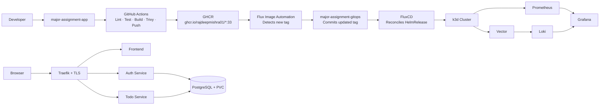

# Todo Platform — GitOps Managed Kubernetes Microservices Platform

> Kubernetes DevOps Trainee Assignment | FluxCD GitOps | Microservices | Helm | Prometheus | Loki

## Overview

A production-style microservices Todo application deployed on a local k3d Kubernetes cluster, managed entirely through FluxCD — no manual `kubectl apply` after initial bootstrap.

**Two repositories:**

| Repo | Purpose |
|---|---|
| [major-assignment-app](https://github.com/rajdeepmishra01/major-assignment-app) | React + Node.js source code, CI pipeline |
| [major-assignment-gitops](https://github.com/rajdeepmishra01/major-assignment-gitops) | Kubernetes, Helm chart, Flux, monitoring, security |

---

## Architecture



---

## Assignment Requirements

| Requirement | Implementation |
|---|---|
| k3d cluster | 1 server + 2 agents, ports 8080/8443 |
| Helm | Custom chart `todo-platform` (v0.1.10) |
| FluxCD GitOps | GitRepository + Kustomization + HelmRelease |
| Image automation | ImageRepository + ImagePolicy + ImageUpdateAutomation |
| Monitoring | Prometheus + Grafana (kube-prometheus-stack) + custom dashboard |
| Logging | Loki + Vector DaemonSet |
| TLS | cert-manager self-signed ClusterIssuer |
| Ingress | Traefik path-based routing |
| Persistence | PostgreSQL PVC (local-path, 1Gi) |
| HPA | frontend + auth + todo (min 2 / max 6 replicas) |
| VPA | todo-service recommendation mode |
| CronJob | PostgreSQL backup simulation |
| RBAC / Security | RBAC, NetworkPolicy, ResourceQuota, LimitRange, PDB |
| CI/CD | GitHub Actions — lint, test, SonarCloud, Trivy, GHCR push |

---

## Repo Structure

```
major-assignment-gitops/
├── clusters/local/
│   ├── flux-system/          Flux bootstrap manifests
│   ├── apps/todo-platform/
│   │   └── helmrelease.yaml  HelmRelease + image policy markers
│   └── kustomization.yaml
├── helm-charts/todo-platform/
│   ├── Chart.yaml
│   ├── values.yaml
│   └── templates/            frontend, auth, todo, postgres, ingress, hpa, secret, configmap
├── advanced/
│   ├── image-automation/     ImageRepository + ImagePolicy + ImageUpdateAutomation
│   ├── vpa/                  VPA for todo-service
│   └── cronjobs/             PostgreSQL backup CronJob
├── monitoring/
│   ├── prometheus/           ServiceMonitor + alerts
│   ├── grafana/              dashboard.json
│   └── loki/                 Loki + Vector values
├── security/
│   └── cert-manager/         ClusterIssuer + Certificate
├── policies/
│   ├── rbac/
│   ├── networkpolicy/
│   ├── resourcequota/
│   ├── limitrange/
│   └── pdb/
└── docs/
    ├── architecture.md
    ├── setup-guide.md
    ├── gitops-flow.md
    ├── monitoring-logging.md
    ├── security-autoscaling.md
    ├── demo-script.md
    └── troubleshooting.md
```

---

## Quick Setup

### 1. Create the cluster

```bash
k3d cluster create todo-platform \
  --servers 1 --agents 2 \
  -p "8080:80@loadbalancer" \
  -p "8443:443@loadbalancer"
```

### 2. Bootstrap Flux

```bash
export GITHUB_TOKEN=<your-pat>

flux bootstrap github \
  --owner=rajdeepmishra01 \
  --repository=major-assignment-gitops \
  --branch=main \
  --path=./clusters/local \
  --personal \
  --components-extra=image-reflector-controller,image-automation-controller
```

Flux will automatically deploy everything — the app, monitoring, logging, and security manifests.

### 3. Verify

```bash
flux get helmreleases -A          # HelmRelease should be READY
kubectl get pods -n todo-platform # All pods Running
kubectl get pods -n monitoring    # Prometheus + Grafana Running
kubectl get pods -n logging       # Loki + Vector Running
flux get image repository -A      # Image scanning active
```

---

## Access

```bash
# Application (accept self-signed cert warning)
open https://localhost:8443

# Grafana
kubectl port-forward -n monitoring svc/monitoring-grafana 3000:80
# http://localhost:3000  admin / prom-operator

# Prometheus
kubectl port-forward -n monitoring svc/monitoring-kube-prometheus-prometheus 9090:9090
```

---

## GitOps Flow

```
git push → GitHub Actions → Docker image :33 pushed to GHCR
→ Flux scans GHCR → detects :33 → commits updated tag to helmrelease.yaml
→ Flux reconciles HelmRelease → Kubernetes rolling update → pods updated
```

Zero manual steps after the initial bootstrap.

---

## Key Learnings

- GitOps enforces desired state — manual changes are reverted within 1 minute
- `$imagepolicy` markers are what link CI image tags to GitOps deployments
- ServiceMonitor `matchLabels` must exactly match service labels or Prometheus gets no targets
- `sum()` in PromQL is required when multiple replicas expose the same business counter
- Vector handles log collection better than Promtail in k3d (inotify limits)
- VPA in Off mode gives right-sizing recommendations without disrupting pods
