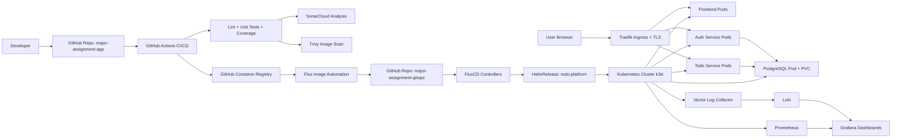
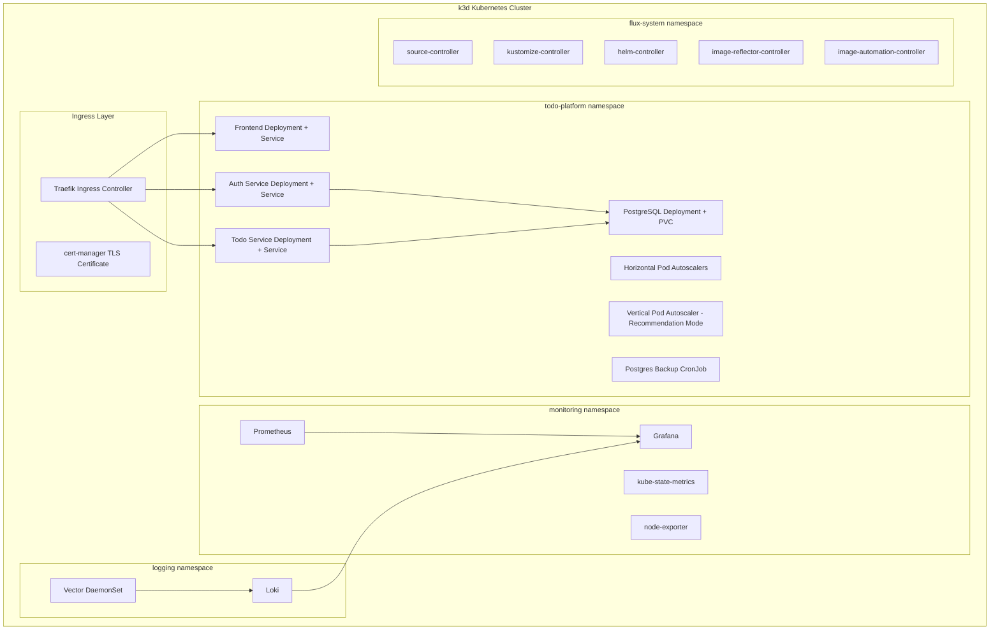

# Todo Platform — GitOps Managed Kubernetes Microservices Platform

> **Kubernetes DevOps Trainee Assignment — Final Submission**
> 3-Week Hands-On Lab | GitOps with FluxCD | Full Microservices Stack

---

## Table of Contents

1. [Project Overview](#1-project-overview)
2. [Assignment Objective Mapping](#2-assignment-objective-mapping)
3. [Tools and Technologies](#3-tools-and-technologies)
4. [Architecture Diagram](#4-architecture-diagram)
5. [Repository Structure](#5-repository-structure)
6. [Application Architecture](#6-application-architecture)
7. [CI/CD Pipeline](#7-cicd-pipeline)
8. [GitOps Workflow](#8-gitops-workflow)
9. [Kubernetes Components](#9-kubernetes-components)
10. [Helm Chart Structure](#10-helm-chart-structure)
11. [Ingress and TLS](#11-ingress-and-tls)
12. [PostgreSQL Persistence](#12-postgresql-persistence)
13. [Monitoring with Prometheus and Grafana](#13-monitoring-with-prometheus-and-grafana)
14. [Logging with Loki and Vector](#14-logging-with-loki-and-vector)
15. [Autoscaling with HPA and VPA](#15-autoscaling-with-hpa-and-vpa)
16. [Security: RBAC, Secrets, NetworkPolicy, TLS](#16-security-rbac-secrets-networkpolicy-tls)
17. [Backup CronJob and Jobs](#17-backup-cronjob-and-jobs)
18. [How to Run Locally with Docker Compose](#18-how-to-run-locally-with-docker-compose)
19. [How to Create the k3d Cluster](#19-how-to-create-the-k3d-cluster)
20. [How to Bootstrap Flux](#20-how-to-bootstrap-flux)
21. [How to Deploy Through GitOps](#21-how-to-deploy-through-gitops)
22. [How to Verify Deployment](#22-how-to-verify-deployment)
23. [How to Test the Application](#23-how-to-test-the-application)
24. [Troubleshooting](#24-troubleshooting)
25. [Screenshots to Include](#25-screenshots-to-include)
26. [Key Learnings](#26-key-learnings)
27. [Challenges Faced](#27-challenges-faced)
28. [Final Completion Summary](#28-final-completion-summary)

---

## 1. Project Overview

**Todo Platform** is a production-grade, cloud-native microservices application deployed on a local Kubernetes cluster using GitOps principles. The platform consists of three independently deployable services — a React frontend, a Node.js authentication service, and a Node.js todo service — all backed by PostgreSQL and managed entirely through FluxCD without any manual `kubectl apply`.

The project demonstrates the full DevOps lifecycle:

- **Source control** → GitHub repositories
- **CI/CD** → GitHub Actions (lint, test, Sonar, Trivy, build, push)
- **Container registry** → GitHub Container Registry (GHCR)
- **GitOps delivery** → FluxCD with Helm and image automation
- **Observability** → Prometheus, Grafana, Loki, Vector
- **Security** → JWT, TLS, RBAC, NetworkPolicy, Sealed Secrets
- **Reliability** → HPA, VPA, PodDisruptionBudget, PVC

There are two Git repositories:

| Repository | Purpose |
|---|---|
| [`major-assignment-app`](https://github.com/rajdeepmishra01/major-assignment-app) | Application source code, Dockerfiles, CI pipeline |
| [`major-assignment-gitops`](https://github.com/rajdeepmishra01/major-assignment-gitops) | Kubernetes manifests, Helm chart, Flux config, monitoring, security |

---

## 2. Assignment Objective Mapping

| Assignment Requirement | Implementation |
|---|---|
| k3d local Kubernetes cluster | k3d `todo-platform` cluster — 1 server, 2 agents, ports 8080/8443 |
| Deploy application workloads | Frontend, auth-service, todo-service, PostgreSQL via HelmRelease |
| Helm packaging | Custom Helm chart `todo-platform` (version 0.1.10) |
| GitOps with Flux | Flux `GitRepository`, `Kustomization`, `HelmRelease` |
| Image automation | Flux `ImageRepository`, `ImagePolicy`, `ImageUpdateAutomation` |
| Monitoring | Prometheus + Grafana with custom dashboard and ServiceMonitors |
| Logging | Loki + Vector DaemonSet with Grafana log panels |
| TLS | cert-manager self-signed `ClusterIssuer` + `Certificate` |
| Ingress | Traefik ingress with path-based routing for all services |
| Persistence | PostgreSQL `PersistentVolumeClaim` via local-path provisioner |
| HPA | HPA for frontend, auth-service, todo-service (min 2 / max 6 replicas) |
| VPA | VPA recommendation mode for todo-service |
| CronJob | PostgreSQL backup simulation CronJob |
| RBAC / Security | RBAC, Secrets, NetworkPolicy, ResourceQuota, LimitRange, PDB |
| CI/CD | GitHub Actions: lint, test, coverage, SonarCloud, Trivy, push to GHCR |
| Documentation | README, architecture diagrams, setup guide, demo script |

---

## 3. Tools and Technologies

| Category | Tool / Technology |
|---|---|
| Language | JavaScript / Node.js, React |
| Build | Vite (frontend) |
| Testing | Vitest, coverage via `@vitest/coverage-v8` |
| Static analysis | ESLint, SonarCloud |
| Container | Docker, Docker Compose |
| Container registry | GitHub Container Registry (GHCR) |
| CI/CD | GitHub Actions |
| Security scanning | Trivy |
| Orchestration | Kubernetes (k3d) |
| Package manager | Helm v3 |
| GitOps | FluxCD v2 |
| Ingress | Traefik |
| TLS | cert-manager |
| Database | PostgreSQL 16 (Alpine) |
| Monitoring | Prometheus, Grafana (kube-prometheus-stack) |
| Logging | Loki, Vector |
| Autoscaling | HPA, VPA |
| Secret management | Kubernetes Secrets, Sealed Secrets |

---

## 4. Architecture Diagram

### Full Platform Flow



### Kubernetes Cluster Layout



---

## 5. Repository Structure

```text
major-assignment-devops/
├── major-assignment-app/                  # Application source code + CI
│   ├── apps/
│   │   ├── frontend/                      # React / Vite SPA
│   │   │   ├── Dockerfile
│   │   │   ├── package.json
│   │   │   ├── index.html
│   │   │   └── src/
│   │   ├── auth-service/                  # Node.js JWT auth API
│   │   │   ├── Dockerfile
│   │   │   ├── package.json
│   │   │   ├── vitest.config.js
│   │   │   └── src/
│   │   ├── todo-service/                  # Node.js todo CRUD API
│   │   │   ├── Dockerfile
│   │   │   ├── package.json
│   │   │   ├── vitest.config.js
│   │   │   └── src/
│   │   └── database/
│   │       └── init.sql                   # PostgreSQL schema
│   ├── .github/workflows/
│   │   └── pipeline.yml                   # GitHub Actions CI/CD
│   ├── docker-compose.yml
│   ├── sonar-project.properties
│   └── README.md
│
└── major-assignment-gitops/               # Kubernetes + GitOps config
    ├── clusters/
    │   └── local/
    │       ├── flux-system/               # Flux bootstrap manifests
    │       ├── apps/
    │       │   └── todo-platform/
    │       │       └── helmrelease.yaml   # HelmRelease with image policies
    │       └── kustomization.yaml
    ├── helm-charts/
    │   └── todo-platform/                 # Custom Helm chart
    │       ├── Chart.yaml
    │       ├── values.yaml
    │       └── templates/
    │           ├── frontend.yaml
    │           ├── auth-service.yaml
    │           ├── todo-service.yaml
    │           ├── postgres.yaml
    │           ├── secret.yaml
    │           ├── configmap.yaml
    │           ├── ingress.yaml
    │           └── hpa.yaml
    ├── advanced/
    │   ├── image-automation/              # Flux ImageRepository/Policy/Update
    │   ├── vpa/                           # VPA manifests
    │   ├── cronjobs/                      # Backup CronJob
    │   └── crds/                          # Custom CRD examples
    ├── monitoring/
    │   ├── prometheus/                    # ServiceMonitor + alerts
    │   ├── grafana/                       # Dashboard JSON
    │   └── loki/                          # Loki + Vector values
    ├── security/
    │   ├── cert-manager/                  # ClusterIssuer + Certificate
    │   └── sealed-secrets/
    ├── policies/
    │   ├── rbac/                          # RBAC manifests
    │   ├── networkpolicy/                 # Network policies
    │   ├── resourcequota/                 # Resource quotas
    │   ├── limitrange/                    # Limit ranges
    │   ├── pdb/                           # PodDisruptionBudget
    │   └── priorityclass/
    └── docs/
        ├── architecture.md
        ├── setup-guide.md
        ├── gitops-flow.md
        ├── monitoring-logging.md
        ├── security-autoscaling.md
        ├── demo-script.md
        └── troubleshooting.md
```

---

## 6. Application Architecture

The application follows a microservices pattern where each service has a single responsibility:

| Service | Technology | Role |
|---|---|---|
| `frontend` | React + Vite + Nginx | Single-page app served via Nginx |
| `auth-service` | Node.js + Express | User registration, login, JWT issuance |
| `todo-service` | Node.js + Express | Todo CRUD, JWT validation |
| `postgres` | PostgreSQL 16 Alpine | Persistent relational database |

### API Routes

**Auth Service** (`/api/auth`):
```
POST /api/auth/register     Register a new user
POST /api/auth/login        Login and receive JWT token
GET  /health                Health check
GET  /metrics               Prometheus metrics
```

**Todo Service** (`/api/todos`):
```
GET    /api/todos            List todos for authenticated user
POST   /api/todos            Create a new todo
PUT    /api/todos/:id        Update a todo
DELETE /api/todos/:id        Delete a todo
GET    /health               Health check
GET    /metrics              Prometheus metrics
```

### Ingress Routing

```
https://localhost:8443/              → frontend
https://localhost:8443/api/auth/*   → auth-service
https://localhost:8443/api/todos/*  → todo-service
```

---

## 7. CI/CD Pipeline

The GitHub Actions pipeline (`.github/workflows/pipeline.yml`) runs on every push to `main`:

```
Step 1 → Checkout source code
Step 2 → Setup Node.js
Step 3 → Install dependencies (root + all services)
Step 4 → ESLint check + Vite frontend build
Step 5 → Vitest unit tests for auth-service
Step 6 → Vitest unit tests for todo-service
Step 7 → Coverage reports (LCOV format)
Step 8 → SonarCloud analysis
Step 9 → Docker image build (frontend, auth-service, todo-service)
Step 10 → Trivy vulnerability scan (report mode — does not block)
Step 11 → Push images to GHCR with build number tag
```

Docker images published:
```
ghcr.io/rajdeepmishra01/frontend:<build-number>
ghcr.io/rajdeepmishra01/auth-service:<build-number>
ghcr.io/rajdeepmishra01/todo-service:<build-number>
```

---

## 8. GitOps Workflow

Flux continuously reconciles the cluster state with the `major-assignment-gitops` repository. No manual `kubectl apply` is needed after initial bootstrap.

```
1. Developer pushes code → major-assignment-app
2. GitHub Actions CI: build + test + push image to GHCR (tag = build number)
3. Flux ImageRepository: scans GHCR for new tags every 1 minute
4. Flux ImagePolicy: selects latest numeric tag
5. Flux ImageUpdateAutomation: updates image tags in helmrelease.yaml → commits to GitOps repo
6. Flux source-controller: detects new commit in GitOps repo
7. Flux kustomize-controller: applies kustomization
8. Flux helm-controller: reconciles HelmRelease with new values
9. Kubernetes: rolling update of affected pods
10. Prometheus + Grafana: metrics updated; Loki: logs collected
```

See [docs/gitops-flow.md](docs/gitops-flow.md) for detailed flow and Flux commands.

---

## 9. Kubernetes Components

All Kubernetes resources are deployed in the `todo-platform` namespace via the Helm chart.

| Resource | Count | Description |
|---|---|---|
| Deployments | 4 | frontend, auth-service, todo-service, postgres |
| Services | 4 | ClusterIP services for each deployment |
| Ingress | 1 | Traefik ingress with TLS |
| ConfigMap | 1 | Environment configuration |
| Secret | 1 | DATABASE_URL, JWT_SECRET |
| PersistentVolumeClaim | 1 | PostgreSQL 1Gi storage |
| HorizontalPodAutoscaler | 3 | frontend, auth-service, todo-service |
| VerticalPodAutoscaler | 1 | todo-service (recommendation mode) |
| CronJob | 1 | PostgreSQL backup simulation |
| Certificate | 1 | cert-manager TLS certificate |
| NetworkPolicy | multiple | Namespace isolation rules |
| ResourceQuota | 1 | Namespace resource limits |
| LimitRange | 1 | Per-pod default limits |
| PodDisruptionBudget | 3 | Availability guarantees |

---

## 10. Helm Chart Structure

The custom Helm chart lives at `helm-charts/todo-platform/`:

```
todo-platform/
├── Chart.yaml          # apiVersion: v2, name: todo-platform, version: 0.1.10
├── values.yaml         # Default values — overridden by HelmRelease
└── templates/
    ├── frontend.yaml       # Deployment + Service
    ├── auth-service.yaml   # Deployment + Service
    ├── todo-service.yaml   # Deployment + Service
    ├── postgres.yaml       # Deployment + Service + PVC
    ├── secret.yaml         # DATABASE_URL + JWT_SECRET
    ├── configmap.yaml      # Environment variables
    ├── ingress.yaml        # Traefik ingress with TLS
    └── hpa.yaml            # HPA for all three services
```

Key values from `values.yaml`:

```yaml
namespace: todo-platform
images:
  frontend: ghcr.io/rajdeepmishra01/frontend:latest
  authService: ghcr.io/rajdeepmishra01/auth-service:latest
  todoService: ghcr.io/rajdeepmishra01/todo-service:latest
hpa:
  enabled: true
  frontend:
    minReplicas: 2
    maxReplicas: 6
    cpuUtilization: 50
```

Image tags in the `HelmRelease` are automatically updated by Flux image automation:

```yaml
# clusters/local/apps/todo-platform/helmrelease.yaml
images:
  frontend: ghcr.io/rajdeepmishra01/frontend:33 # {"$imagepolicy": "flux-system:frontend"}
  authService: ghcr.io/rajdeepmishra01/auth-service:33 # {"$imagepolicy": "flux-system:auth-service"}
  todoService: ghcr.io/rajdeepmishra01/todo-service:33 # {"$imagepolicy": "flux-system:todo-service"}
```

---

## 11. Ingress and TLS

Traefik is the ingress controller included with k3d. All traffic enters the cluster through port `8443` (HTTPS) or `8080` (HTTP).

cert-manager is used to manage TLS certificates. A self-signed `ClusterIssuer` issues a `Certificate` for `localhost`.

```
Browser → https://localhost:8443
              → Traefik (TLS termination via cert-manager certificate)
                  → /              → frontend:80
                  → /api/auth/*    → auth-service:3001
                  → /api/todos/*   → todo-service:3002
```

---

## 12. PostgreSQL Persistence

PostgreSQL is deployed as a single-pod `Deployment` with a `PersistentVolumeClaim` bound to the `local-path` storage class provided by k3d.

- Storage: `1Gi`
- StorageClass: `local-path`
- Mount path: `/var/lib/postgresql/data`
- Database survives pod restarts and rescheduling

The `init.sql` script creates the `users` and `todos` tables on first startup.

---

## 13. Monitoring with Prometheus and Grafana

Prometheus and Grafana are installed via the `kube-prometheus-stack` Helm chart in the `monitoring` namespace.

Custom `ServiceMonitor` resources (in `monitoring/prometheus/servicemonitor.yaml`) configure Prometheus to scrape:
- `auth-service:3001/metrics`
- `todo-service:3002/metrics`

The Grafana dashboard (`monitoring/grafana/dashboard.json`) includes:

- Running pod count per service
- Pod restart count
- Auth and todo request counts
- Service health (up/down)
- HTTP 4xx/5xx error rates
- Request rate by HTTP method
- HTTP status code distribution
- Node.js heap memory usage
- Node.js CPU usage
- Business metrics: total users, total todos, active/completed todos, completion rate
- HPA min/max/current replica status
- Loki log panels per service

**Access Grafana:**
```bash
kubectl port-forward -n monitoring svc/monitoring-grafana 3000:80
# Open http://localhost:3000 — default credentials: admin / prom-operator
```

**Access Prometheus:**
```bash
kubectl port-forward -n monitoring svc/monitoring-kube-prometheus-prometheus 9090:9090
# Open http://localhost:9090
```

See [docs/monitoring-logging.md](docs/monitoring-logging.md) for full details.

---

## 14. Logging with Loki and Vector

Loki is deployed in the `logging` namespace as the log aggregation backend. Vector is deployed as a `DaemonSet` to collect logs from all pods and forward them to Loki.

Logs collected from:
- `frontend` pods
- `auth-service` pods
- `todo-service` pods
- `postgres` pods

Logs are available in Grafana under **Explore → Loki** and in the dashboard log panels.

**Access Loki directly:**
```bash
kubectl port-forward -n logging svc/loki 3100:3100
curl http://localhost:3100/ready
```

---

## 15. Autoscaling with HPA and VPA

### Horizontal Pod Autoscaler (HPA)

Three HPAs are deployed, one per application service:

| HPA | Min Replicas | Max Replicas | Target CPU |
|---|---|---|---|
| `frontend-hpa` | 2 | 6 | 50% |
| `auth-service-hpa` | 2 | 6 | 50% |
| `todo-service-hpa` | 2 | 6 | 50% |

### Vertical Pod Autoscaler (VPA)

`todo-service-vpa` is deployed in **Off / recommendation-only** mode. It analyzes actual CPU and memory usage and provides recommendations without automatically restarting pods. This makes it safe to observe in production-like environments.

```bash
kubectl describe vpa todo-service-vpa -n todo-platform
```

See [docs/security-autoscaling.md](docs/security-autoscaling.md) for full details.

---

## 16. Security: RBAC, Secrets, NetworkPolicy, TLS

| Security Layer | Implementation |
|---|---|
| Authentication | JWT tokens issued by auth-service |
| Kubernetes Secrets | `DATABASE_URL` and `JWT_SECRET` stored as base64-encoded Secrets |
| TLS | cert-manager self-signed `ClusterIssuer` + `Certificate` |
| Network isolation | `NetworkPolicy` manifests in `policies/networkpolicy/` |
| RBAC | `Role` and `RoleBinding` manifests in `policies/rbac/` |
| Resource limits | `ResourceQuota` and `LimitRange` in `policies/resourcequota/` and `policies/limitrange/` |
| Availability | `PodDisruptionBudget` in `policies/pdb/` |

See [docs/security-autoscaling.md](docs/security-autoscaling.md) for full details.

---

## 17. Backup CronJob and Jobs

A `CronJob` in the `todo-platform` namespace simulates periodic PostgreSQL backups using `pg_dump`.

Purpose:
- Demonstrates Kubernetes `CronJob` and `Job` objects
- Simulates a real backup workflow
- Satisfies the assignment requirement for scheduled workloads

```bash
kubectl get cronjob -n todo-platform
kubectl get jobs -n todo-platform
kubectl logs job/<job-name> -n todo-platform
```

---

## 18. How to Run Locally with Docker Compose

The application can be run locally using Docker Compose before deploying to Kubernetes.

```bash
cd major-assignment-app
docker compose up --build
```

Services available:
```
http://localhost:3000   → frontend
http://localhost:3001   → auth-service
http://localhost:3002   → todo-service
http://localhost:5432   → PostgreSQL
```

---

## 19. How to Create the k3d Cluster

```bash
# Install k3d (if not installed)
curl -s https://raw.githubusercontent.com/k3d-io/k3d/main/install.sh | bash

# Create the cluster
k3d cluster create todo-platform \
  --servers 1 \
  --agents 2 \
  -p "8080:80@loadbalancer" \
  -p "8443:443@loadbalancer"

# Verify
kubectl get nodes -o wide
```

The cluster includes:
- 1 server node (control plane)
- 2 agent nodes (workers)
- Traefik ingress controller
- `local-path` storage provisioner

---

## 20. How to Bootstrap Flux

```bash
# Prerequisites: flux CLI, GitHub PAT with repo permissions

export GITHUB_TOKEN=<your-github-pat>
export GITHUB_USER=rajdeepmishra01

# Bootstrap Flux onto the cluster
flux bootstrap github \
  --owner=$GITHUB_USER \
  --repository=major-assignment-gitops \
  --branch=main \
  --path=./clusters/local \
  --personal

# Verify Flux is running
flux check
kubectl get pods -n flux-system
```

Flux will install the following controllers:
- `source-controller`
- `kustomize-controller`
- `helm-controller`
- `image-reflector-controller`
- `image-automation-controller`

---

## 21. How to Deploy Through GitOps

After Flux is bootstrapped, it automatically reconciles everything in `clusters/local/`. No manual `kubectl apply` is needed.

To trigger a new deployment manually (e.g., to test a change):

```bash
# Force Flux to reconcile immediately
flux reconcile source git flux-system
flux reconcile kustomization flux-system

# Check HelmRelease status
flux get helmreleases -A

# Watch pod rollout
kubectl rollout status deployment/todo-platform-frontend -n todo-platform
kubectl rollout status deployment/todo-platform-auth-service -n todo-platform
kubectl rollout status deployment/todo-platform-todo-service -n todo-platform
```

---

## 22. How to Verify Deployment

```bash
# Cluster
kubectl get nodes -o wide

# All namespaces
kubectl get pods -A
kubectl get ns

# Application pods
kubectl get pods -n todo-platform
kubectl get svc -n todo-platform
kubectl get ingress -n todo-platform

# TLS
kubectl get certificate -A

# Persistence
kubectl get pvc -n todo-platform

# Autoscaling
kubectl get hpa -n todo-platform
kubectl get vpa -n todo-platform

# Scheduled workloads
kubectl get cronjob -n todo-platform

# Network and policies
kubectl get networkpolicy -n todo-platform
kubectl get resourcequota -n todo-platform
kubectl get limitrange -n todo-platform

# Flux GitOps status
flux get sources git -A
flux get kustomizations -A
flux get helmreleases -A
flux get image repository -A
flux get image policy -A
flux get image update -A
```

---

## 23. How to Test the Application

```bash
# Health checks
curl -k https://localhost:8443/
curl -k https://localhost:8443/api/auth/health
curl -k https://localhost:8443/api/todos/health

# Register a user
curl -k -X POST https://localhost:8443/api/auth/register \
  -H "Content-Type: application/json" \
  -d '{"username":"testuser","password":"testpass"}'

# Login
curl -k -X POST https://localhost:8443/api/auth/login \
  -H "Content-Type: application/json" \
  -d '{"username":"testuser","password":"testpass"}'

# Use the returned token for todo operations
TOKEN="<jwt-token-from-login>"

curl -k https://localhost:8443/api/todos \
  -H "Authorization: Bearer $TOKEN"

curl -k -X POST https://localhost:8443/api/todos \
  -H "Content-Type: application/json" \
  -H "Authorization: Bearer $TOKEN" \
  -d '{"title":"My first todo"}'
```

---

## 24. Troubleshooting

See [docs/troubleshooting.md](docs/troubleshooting.md) for a complete troubleshooting guide covering:
- Image pull failures
- Flux reconciliation errors
- Prometheus ServiceMonitor issues
- Loki connection problems
- VPA and HPA behavior
- cert-manager certificate issues

---

## 25. Screenshots to Include

For the demo/evaluation, include screenshots of:

1. GitHub Actions pipeline — green build with all steps
2. GHCR — Docker images with build number tags
3. `flux get helmreleases -A` — READY status
4. `kubectl get pods -n todo-platform` — all pods Running
5. Grafana dashboard — full view with metrics
6. Prometheus targets — auth-service and todo-service UP
7. Loki logs in Grafana Explore
8. `kubectl get hpa -n todo-platform` — HPA status
9. Application in browser — login and todo creation
10. Flux image automation — commit in gitops repo from flux bot

---

## 26. Key Learnings

- **Kubernetes controllers** maintain desired state by continuously reconciling actual vs. declared configuration — this is the foundation of GitOps.
- **Helm** provides a powerful templating layer that makes it possible to manage all Kubernetes resources for a multi-service application from a single chart with parameterized values.
- **FluxCD** implements GitOps by treating the Git repository as the single source of truth — any drift from the declared state is automatically corrected.
- **Image automation** removes the last manual step in the deployment cycle: once a new image is pushed to GHCR, Flux detects it, updates the GitOps repo, and triggers a rolling deployment — all without human intervention.
- **Prometheus ServiceMonitor** requires that service labels exactly match the ServiceMonitor selector; a mismatch silently results in no scrape targets.
- **Grafana dashboards** can mix infrastructure metrics (from Prometheus) with log panels (from Loki) to give a unified view of application health.
- **HPA and VPA serve complementary purposes**: HPA scales horizontally in response to load, while VPA in recommendation mode provides right-sizing guidance without causing disruption.
- **PersistentVolumes** decouple storage from pod lifecycle — the database survives pod restarts and rescheduling, which is critical for stateful workloads.
- **cert-manager** automates the entire TLS certificate lifecycle — from issuing to renewing — reducing operational overhead significantly.
- **Vector** proved more reliable than Promtail for log collection in this environment due to better handling of file descriptor limits.

---

## 27. Challenges Faced

| Challenge | Root Cause | Resolution |
|---|---|---|
| Docker image pull failures | GHCR authentication not configured in cluster | Added `imagePullSecret` with GHCR credentials |
| Flux image tags detected but pods not updating | HelmRelease not reconciling after automation commit | Forced `flux reconcile helmrelease todo-platform` |
| Prometheus had no scrape targets | ServiceMonitor selector labels did not match service labels | Aligned `matchLabels` in ServiceMonitor with service labels |
| Loki not connected in Grafana | Wrong Loki URL (missing namespace in service name) | Updated Grafana datasource URL to `http://loki.logging:3100` |
| Promtail crashing | Too many open files (inotify limit) | Switched to Vector DaemonSet as log collector |
| Grafana showing duplicate metric values | Multiple pod replicas each exposing identical business counters | Used `sum()` aggregation in PromQL queries |
| Todo service panel showing Down | Prometheus label `job` did not match dashboard query | Matched the `job` label value in ServiceMonitor to the dashboard query |
| SonarCloud coverage upload failure | LCOV file path prefix mismatch | Added `sonar.javascript.lcov.reportPaths` with correct relative path |
| Trivy scan blocking pipeline | Trivy found HIGH severity CVEs in base images | Set `exit-code: 0` to report without failing the pipeline |

---

## 28. Final Completion Summary

All assignment requirements have been implemented and verified:

- [x] k3d local Kubernetes cluster with 1 server and 2 agents
- [x] Real microservices application (React + Node.js + PostgreSQL)
- [x] Custom Helm chart packaging all Kubernetes resources
- [x] FluxCD GitOps with HelmRelease managed deployment
- [x] Flux image automation — zero-touch deployments from CI to cluster
- [x] Prometheus + Grafana monitoring with custom dashboard
- [x] Loki + Vector centralized logging
- [x] HPA for all three application services
- [x] VPA in recommendation mode
- [x] cert-manager TLS with Traefik ingress
- [x] PostgreSQL with PersistentVolumeClaim
- [x] PostgreSQL backup simulation CronJob
- [x] RBAC, NetworkPolicy, ResourceQuota, LimitRange, PodDisruptionBudget
- [x] GitHub Actions CI/CD with lint, test, SonarCloud, Trivy, GHCR push
- [x] Complete documentation with architecture diagrams, setup guide, demo script

---

*Generated for Kubernetes DevOps Trainee Assignment — June 2026*