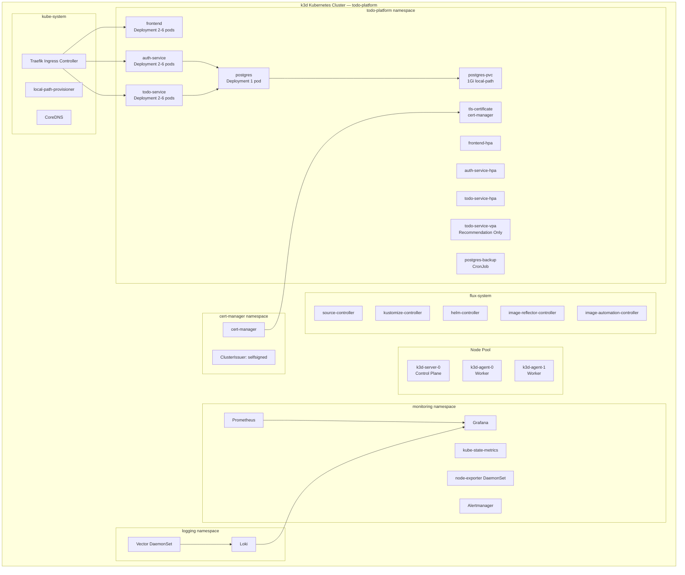

# Architecture — Todo Platform

> Deep-dive into the system design, component interactions, and data flows.

---

## Table of Contents

1. [System Overview](#1-system-overview)
2. [Full Platform Flow Diagram](#2-full-platform-flow-diagram)
3. [Kubernetes Cluster Layout](#3-kubernetes-cluster-layout)
4. [Application Component Architecture](#4-application-component-architecture)
5. [Network and Routing Architecture](#5-network-and-routing-architecture)
6. [Data Flow: User Request](#6-data-flow-user-request)
7. [Data Flow: CI/CD to GitOps Deployment](#7-data-flow-cicd-to-gitops-deployment)
8. [Data Flow: Monitoring and Logging](#8-data-flow-monitoring-and-logging)
9. [Storage Architecture](#9-storage-architecture)
10. [Security Architecture](#10-security-architecture)
11. [Namespace Layout](#11-namespace-layout)
12. [Component Dependency Map](#12-component-dependency-map)

---

## 1. System Overview

The Todo Platform is built on a **microservices architecture** deployed on a **local Kubernetes cluster** managed entirely by **GitOps**. The system is composed of:

- A user-facing **React SPA** served by Nginx
- A stateless **Auth Service** that issues and validates JWT tokens
- A stateless **Todo Service** that handles CRUD operations, protected by JWT
- A stateful **PostgreSQL** database with a PersistentVolumeClaim
- A **GitOps control plane** powered by FluxCD
- A **CI/CD pipeline** powered by GitHub Actions
- A **monitoring stack** using Prometheus and Grafana
- A **logging stack** using Loki and Vector

All Kubernetes resources are defined in the `major-assignment-gitops` Git repository. FluxCD continuously synchronizes the cluster state with this repository. No direct `kubectl apply` is performed in normal operations.

---

## 2. Full Platform Flow Diagram

```mermaid
flowchart LR
    Dev[Developer] --> GitHubApp[GitHub Repo\nmajor-assignment-app]
    GitHubApp --> Actions[GitHub Actions CI/CD]

    subgraph CI[CI Pipeline]
        Actions --> Lint[Lint + Build]
        Actions --> Tests[Unit Tests + Coverage]
        Tests --> Sonar[SonarCloud Analysis]
        Actions --> DockerBuild[Docker Image Build]
        DockerBuild --> Trivy[Trivy Vulnerability Scan]
        DockerBuild --> GHCR[Push to GHCR]
    end

    GHCR --> FluxImage[Flux ImageRepository\nPolling GHCR every 1m]
    FluxImage --> ImagePolicy[Flux ImagePolicy\nSelect latest numeric tag]
    ImagePolicy --> ImageUpdate[Flux ImageUpdateAutomation\nCommit updated tag to GitOps repo]
    ImageUpdate --> GitOpsRepo[GitHub Repo\nmajor-assignment-gitops]

    GitOpsRepo --> SourceCtrl[source-controller\nDetects new commit]
    SourceCtrl --> KustomizeCtrl[kustomize-controller\nApplies Kustomization]
    KustomizeCtrl --> HelmCtrl[helm-controller\nReconciles HelmRelease]
    HelmCtrl --> K8s[Kubernetes Cluster]

    subgraph K8s[k3d Kubernetes Cluster]
        K8s --> Frontend[Frontend Pods]
        K8s --> Auth[Auth Service Pods]
        K8s --> Todo[Todo Service Pods]
        K8s --> DB[PostgreSQL + PVC]
    end

    User[User Browser] --> Ingress[Traefik Ingress\nTLS Termination]
    Ingress --> Frontend
    Ingress --> Auth
    Ingress --> Todo
    Todo --> DB
    Auth --> DB

    K8s --> Prom[Prometheus\nScrapes /metrics]
    Prom --> Graf[Grafana\nDashboards]
    K8s --> Vector[Vector DaemonSet\nCollects pod logs]
    Vector --> Loki[Loki\nLog storage]
    Loki --> Graf
```

---

## 3. Kubernetes Cluster Layout



---

## 4. Application Component Architecture

### Frontend

- **Runtime**: Nginx serving static files built by Vite
- **Base image**: `node:20-alpine` (build) → `nginx:alpine` (serve)
- **Communication**: All API calls go through the Traefik ingress
- **No direct service-to-service communication** from the frontend

### Auth Service

- **Runtime**: Node.js + Express
- **Port**: `3001`
- **Responsibilities**:
  - User registration (hash password with bcrypt)
  - User login (verify password, issue JWT)
  - Token validation middleware (used internally by todo-service via HTTP header forwarding)
- **Database**: Connects to PostgreSQL via `DATABASE_URL`
- **Metrics**: Exposes Prometheus metrics on `/metrics` via `prom-client`

### Todo Service

- **Runtime**: Node.js + Express
- **Port**: `3002`
- **Responsibilities**:
  - CRUD operations for todos
  - JWT validation on every request (verifies token issued by auth-service)
  - User-scoped todo access (todos are filtered by `user_id`)
- **Database**: Connects to PostgreSQL via `DATABASE_URL`
- **Metrics**: Exposes Prometheus metrics on `/metrics` via `prom-client`

### PostgreSQL

- **Image**: `postgres:16-alpine`
- **Port**: `5432`
- **Initialization**: `init.sql` creates `users` and `todos` tables
- **Persistence**: Mounted PVC ensures data survives pod restarts

---

## 5. Network and Routing Architecture

```
Internet / localhost
        │
        │ :8443 (HTTPS)
        ▼
┌─────────────────────────────────────────────────┐
│  Traefik Ingress Controller (kube-system)        │
│  TLS termination via cert-manager Certificate    │
│                                                  │
│  Route rules:                                    │
│  /               → frontend-svc:80              │
│  /api/auth/*     → auth-service-svc:3001        │
│  /api/todos/*    → todo-service-svc:3002        │
└─────────────────────────────────────────────────┘
        │                │                │
        ▼                ▼                ▼
  frontend pods    auth-service      todo-service
  (Nginx:80)       pods (3001)       pods (3002)
                        │                │
                        └────────────────┘
                                 │
                                 ▼
                         PostgreSQL pod
                         (ClusterIP:5432)
```

All internal service-to-service communication uses Kubernetes `ClusterIP` services. Services are only reachable within the cluster by pod name or service DNS (e.g., `postgres.todo-platform.svc.cluster.local`).

---

## 6. Data Flow: User Request

```
1. User opens https://localhost:8443 in browser
2. Traefik receives request on port 8443
3. Traefik terminates TLS using the cert-manager Certificate
4. Route / → frontend-svc → Frontend pod (Nginx serves index.html)
5. Browser loads React SPA
6. User submits login form
7. React sends POST /api/auth/login
8. Traefik routes /api/auth/* → auth-service pod
9. Auth service validates credentials from PostgreSQL
10. Auth service returns JWT token
11. React stores JWT in memory/localStorage
12. User creates a todo
13. React sends POST /api/todos with Authorization: Bearer <token>
14. Traefik routes /api/todos/* → todo-service pod
15. Todo service validates JWT
16. Todo service inserts record into PostgreSQL
17. Todo service returns created todo
18. React updates UI
```

---

## 7. Data Flow: CI/CD to GitOps Deployment

```
1. Developer commits and pushes to major-assignment-app main branch
2. GitHub Actions pipeline triggers
3. Pipeline: Install dependencies → lint → build frontend → run tests → collect coverage
4. Pipeline: SonarCloud analysis (non-blocking)
5. Pipeline: Docker build for frontend, auth-service, todo-service
6. Pipeline: Trivy scan (non-blocking, report only)
7. Pipeline: docker push to GHCR with tag = GitHub run number (e.g., :33)

8. Flux image-reflector-controller polls GHCR every 1 minute
9. New tag :33 detected for all three images
10. Flux ImagePolicy selects latest numeric tag
11. Flux image-automation-controller:
    - Opens clusters/local/apps/todo-platform/helmrelease.yaml
    - Updates image tags using "$imagepolicy" marker comments
    - Commits change to major-assignment-gitops main branch with message "Update image tags"

12. Flux source-controller detects new commit in major-assignment-gitops
13. Flux kustomize-controller applies updated Kustomization
14. Flux helm-controller reconciles HelmRelease todo-platform
15. Helm renders new templates with updated image tags
16. Kubernetes receives updated Deployment specs
17. Kubernetes performs rolling update (zero-downtime)
18. Old pods terminate after new pods pass readiness checks
19. Prometheus scrapes updated pod metrics
20. Vector collects logs from new pods and forwards to Loki
```

---

## 8. Data Flow: Monitoring and Logging

### Metrics Flow

```
auth-service pod     → GET /metrics     → Prometheus (via ServiceMonitor)
todo-service pod     → GET /metrics     → Prometheus (via ServiceMonitor)
All pods/nodes       → kube-state-metrics + node-exporter → Prometheus
Prometheus           → scraped data     → Grafana (Prometheus datasource)
Grafana              → renders          → Dashboard panels
```

### Logging Flow

```
All pod containers write logs to stdout/stderr
Vector DaemonSet runs on every node
Vector reads /var/log/containers/*.log
Vector parses and enriches log entries (adds pod, namespace, container labels)
Vector forwards to Loki HTTP endpoint
Loki stores log streams indexed by labels
Grafana → Explore → Loki datasource → LogQL queries
Grafana dashboard log panels display filtered logs per service
```

---

## 9. Storage Architecture

```
┌─────────────────────────────────────────────────────────┐
│  todo-platform namespace                                 │
│                                                          │
│  postgres Deployment                                     │
│  └── volumeMount: /var/lib/postgresql/data               │
│       └── PersistentVolumeClaim: postgres-pvc            │
│            └── StorageClass: local-path                  │
│                 └── PersistentVolume (auto-provisioned)  │
│                      └── Host path on k3d agent node     │
└─────────────────────────────────────────────────────────┘
```

The `local-path` provisioner creates a directory on one of the agent nodes to back the PVC. Data persists across pod restarts and rescheduling as long as the node exists.

**Capacity**: `1Gi`
**Access Mode**: `ReadWriteOnce`

---

## 10. Security Architecture

```
┌───────────────────────────────────────────────────────┐
│  Perimeter                                             │
│  Traefik + cert-manager TLS (self-signed ClusterIssuer)│
└───────────────────────────────────────────────────────┘
                │
                ▼
┌───────────────────────────────────────────────────────┐
│  Application Layer                                     │
│  JWT authentication (issued by auth-service)           │
│  Todo-service validates JWT on every request           │
└───────────────────────────────────────────────────────┘
                │
                ▼
┌───────────────────────────────────────────────────────┐
│  Kubernetes Layer                                      │
│  Secrets: DATABASE_URL, JWT_SECRET                     │
│  NetworkPolicy: namespace isolation                    │
│  RBAC: Role + RoleBinding per namespace               │
│  ResourceQuota: CPU/memory limits per namespace        │
│  LimitRange: default pod limits                        │
│  PodDisruptionBudget: availability guarantee           │
└───────────────────────────────────────────────────────┘
                │
                ▼
┌───────────────────────────────────────────────────────┐
│  CI/CD Layer                                           │
│  Trivy image scanning (vulnerability report)           │
│  SonarCloud static analysis                            │
│  GHCR: private registry with GitHub auth              │
└───────────────────────────────────────────────────────┘
```

---

## 11. Namespace Layout

| Namespace | Contents |
|---|---|
| `kube-system` | Traefik, CoreDNS, local-path-provisioner, kube-proxy |
| `flux-system` | All Flux controllers, GitRepository, Kustomization, HelmRelease, ImageRepository, ImagePolicy, ImageUpdateAutomation |
| `todo-platform` | Frontend, auth-service, todo-service, postgres, HPAs, VPA, CronJob, Certificate, ConfigMap, Secret, NetworkPolicy, PVC |
| `monitoring` | Prometheus, Grafana, kube-state-metrics, node-exporter, Alertmanager |
| `logging` | Loki, Vector DaemonSet |
| `cert-manager` | cert-manager controller, ClusterIssuer |

---

## 12. Component Dependency Map

```
Flux (flux-system)
  └── Reads: major-assignment-gitops Git repo
  └── Manages: HelmRelease → todo-platform Helm chart
  └── Manages: Image updates in helmrelease.yaml

HelmRelease (todo-platform)
  └── Deploys: Frontend, Auth Service, Todo Service, PostgreSQL
  └── Creates: Services, Ingress, Secret, ConfigMap, PVC, HPA

Ingress (Traefik)
  └── Depends on: Certificate (cert-manager)
  └── Routes to: Frontend, Auth Service, Todo Service

Auth Service
  └── Depends on: PostgreSQL (via DATABASE_URL secret)
  └── Exposes: /metrics (scraped by Prometheus)

Todo Service
  └── Depends on: PostgreSQL (via DATABASE_URL secret)
  └── Validates: JWT (using JWT_SECRET from secret)
  └── Exposes: /metrics (scraped by Prometheus)

PostgreSQL
  └── Depends on: PersistentVolumeClaim (postgres-pvc)
  └── Initialized by: init.sql (via env POSTGRES_DB)

Prometheus
  └── Depends on: ServiceMonitor (selects auth-service and todo-service)
  └── Feeds: Grafana

Loki
  └── Receives: logs from Vector DaemonSet
  └── Feeds: Grafana

Vector (DaemonSet)
  └── Reads: /var/log/containers/*.log from each node
  └── Forwards to: Loki

HPA
  └── Monitors: CPU utilization of each deployment
  └── Scales: Frontend, Auth Service, Todo Service (min 2 / max 6)

VPA (Recommendation Mode)
  └── Monitors: Resource usage of Todo Service
  └── Outputs: CPU/memory recommendations (no auto-apply)

CronJob (postgres-backup)
  └── Runs: pg_dump simulation on schedule
  └── Creates: Kubernetes Job on each trigger
```

---

*See [setup-guide.md](setup-guide.md) for step-by-step reproduction instructions.*
