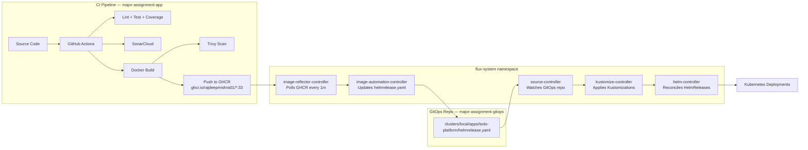

# GitOps Flow — Todo Platform

> How FluxCD manages the full deployment lifecycle from Git commit to running pods.

---

## Table of Contents

1. [What is GitOps?](#1-what-is-gitops)
2. [GitOps Architecture](#2-gitops-architecture)
3. [Flux Component Overview](#3-flux-component-overview)
4. [Step-by-Step GitOps Flow](#4-step-by-step-gitops-flow)
5. [Flux Resource Definitions](#5-flux-resource-definitions)
6. [Image Automation Deep Dive](#6-image-automation-deep-dive)
7. [HelmRelease Lifecycle](#7-helmrelease-lifecycle)
8. [Drift Detection and Self-Healing](#8-drift-detection-and-self-healing)
9. [Flux CLI Commands Reference](#9-flux-cli-commands-reference)
10. [Kustomization Structure](#10-kustomization-structure)

---

## 1. What is GitOps?

GitOps is an operational framework where:

- The **Git repository is the single source of truth** for the desired cluster state
- All changes are made through **Git commits and pull requests**, not direct cluster commands
- An operator (FluxCD in this case) **continuously reconciles** the actual cluster state with the desired state in Git
- Any **manual changes** (drift) made directly to the cluster are automatically corrected by the operator

**Core principle**: If it's not in Git, it doesn't exist in the cluster.

---

## 2. GitOps Architecture



---

## 3. Flux Component Overview

| Flux Component | CRD Kind | Responsibility |
|---|---|---|
| `source-controller` | `GitRepository` | Watches Git repos, fetches artifacts on new commits |
| `kustomize-controller` | `Kustomization` | Applies Kustomize overlays, manages resource sets |
| `helm-controller` | `HelmRelease` | Installs/upgrades Helm charts from source artifacts |
| `image-reflector-controller` | `ImageRepository`, `ImagePolicy` | Scans container registries, applies version policy |
| `image-automation-controller` | `ImageUpdateAutomation` | Commits updated image tags back to the GitOps repo |

All five controllers are installed in the `flux-system` namespace.

---

## 4. Step-by-Step GitOps Flow

### Phase 1 — Developer pushes code

```
Developer → git push → major-assignment-app/main
```

### Phase 2 — GitHub Actions CI pipeline runs

```
GitHub Actions triggers on push to main
  ├── Install dependencies
  ├── Lint (ESLint) + Build (Vite)
  ├── Run unit tests (Vitest) for auth-service and todo-service
  ├── Collect coverage reports (LCOV)
  ├── SonarCloud analysis
  ├── Docker build: frontend, auth-service, todo-service
  ├── Trivy vulnerability scan (report-only, does not block)
  └── Push images to GHCR with tag = GitHub Actions run number
       ghcr.io/rajdeepmishra01/frontend:33
       ghcr.io/rajdeepmishra01/auth-service:33
       ghcr.io/rajdeepmishra01/todo-service:33
```

### Phase 3 — Flux detects new images

```
image-reflector-controller polls GHCR every 1 minute
  ├── ImageRepository: ghcr.io/rajdeepmishra01/frontend
  ├── ImageRepository: ghcr.io/rajdeepmishra01/auth-service
  └── ImageRepository: ghcr.io/rajdeepmishra01/todo-service

ImagePolicy evaluates: "latest numerical tag"
  └── Result: tag :33 selected for all three images
```

### Phase 4 — Flux updates the GitOps repo

```
image-automation-controller reads:
  clusters/local/apps/todo-platform/helmrelease.yaml

Finds marker comments:
  # {"$imagepolicy": "flux-system:frontend"}
  # {"$imagepolicy": "flux-system:auth-service"}
  # {"$imagepolicy": "flux-system:todo-service"}

Updates image tags from :32 to :33

Commits to major-assignment-gitops main branch:
  Author: flux-image-automation <flux@example.com>
  Message: "Update image tags"
```

### Phase 5 — Flux reconciles the cluster

```
source-controller detects new commit in major-assignment-gitops
  └── Fetches updated artifact

kustomize-controller applies Kustomization:
  clusters/local/kustomization.yaml
  └── References: flux-system/, apps/, monitoring, policies

helm-controller reconciles HelmRelease: todo-platform
  └── Runs: helm upgrade todo-platform ./helm-charts/todo-platform
  └── With new values: images.frontend = :33, etc.

Kubernetes receives updated Deployment specs
  └── Rolling update: new pods start before old pods terminate
  └── Readiness probes gate the rollout
  └── Old pods terminate after new pods are Ready
```

### Phase 6 — Observability picks up the change

```
Prometheus scrapes /metrics from new pods
Grafana dashboards reflect updated metrics
Vector collects logs from new pods and forwards to Loki
```

---

## 5. Flux Resource Definitions

### GitRepository

Defined in `clusters/local/flux-system/gotk-sync.yaml`. Points to the GitOps repository.

```yaml
apiVersion: source.toolkit.fluxcd.io/v1
kind: GitRepository
metadata:
  name: flux-system
  namespace: flux-system
spec:
  interval: 1m
  url: https://github.com/rajdeepmishra01/major-assignment-gitops
  ref:
    branch: main
```

### HelmRelease

Located at `clusters/local/apps/todo-platform/helmrelease.yaml`:

```yaml
apiVersion: helm.toolkit.fluxcd.io/v2
kind: HelmRelease
metadata:
  name: todo-platform
  namespace: flux-system
spec:
  interval: 1m
  releaseName: todo-platform
  targetNamespace: todo-platform
  chart:
    spec:
      chart: ./helm-charts/todo-platform
      sourceRef:
        kind: GitRepository
        name: flux-system
        namespace: flux-system
      interval: 1m
  install:
    createNamespace: true
    remediation:
      retries: 3
  upgrade:
    remediation:
      retries: 3
  values:
    images:
      frontend: ghcr.io/rajdeepmishra01/frontend:33 # {"$imagepolicy": "flux-system:frontend"}
      authService: ghcr.io/rajdeepmishra01/auth-service:33 # {"$imagepolicy": "flux-system:auth-service"}
      todoService: ghcr.io/rajdeepmishra01/todo-service:33 # {"$imagepolicy": "flux-system:todo-service"}
    replicas:
      frontend: 3
      authService: 3
      todoService: 3
```

### ImageRepository

Located at `advanced/image-automation/frontend-image-repository.yaml`:

```yaml
apiVersion: image.toolkit.fluxcd.io/v1beta2
kind: ImageRepository
metadata:
  name: frontend
  namespace: flux-system
spec:
  image: ghcr.io/rajdeepmishra01/frontend
  interval: 1m
  secretRef:
    name: ghcr-credentials
```

### ImagePolicy

Located at `advanced/image-automation/frontend-image-policy.yaml`:

```yaml
apiVersion: image.toolkit.fluxcd.io/v1beta2
kind: ImagePolicy
metadata:
  name: frontend
  namespace: flux-system
spec:
  imageRepositoryRef:
    name: frontend
  policy:
    numerical:
      order: asc
```

### ImageUpdateAutomation

Located at `advanced/image-automation/image-update-automation.yaml`:

```yaml
apiVersion: image.toolkit.fluxcd.io/v1beta2
kind: ImageUpdateAutomation
metadata:
  name: todo-platform-image-update
  namespace: flux-system
spec:
  interval: 1m
  sourceRef:
    kind: GitRepository
    name: flux-system
  git:
    checkout:
      ref:
        branch: main
    commit:
      author:
        name: flux-image-automation
        email: flux@example.com
      messageTemplate: "Update image tags"
    push:
      branch: main
  update:
    path: ./clusters/local/apps/todo-platform
    strategy: Setters
```

---

## 6. Image Automation Deep Dive

The `$imagepolicy` marker comment is the key mechanism that links image tags in the HelmRelease to the ImagePolicy:

```yaml
# In helmrelease.yaml
images:
  frontend: ghcr.io/rajdeepmishra01/frontend:33 # {"$imagepolicy": "flux-system:frontend"}
```

How it works:
1. `image-automation-controller` scans the file at the configured `update.path`
2. It finds lines containing `# {"$imagepolicy": "<namespace>:<name>"}`
3. It looks up the `ImagePolicy` named `frontend` in namespace `flux-system`
4. The ImagePolicy's `.status.latestImage` contains the current latest image (e.g., `:33`)
5. The controller replaces the image tag in the file with the latest tag
6. It commits and pushes the change to the GitOps repo

This creates a **fully automated, zero-touch deployment loop**: push code → CI builds image → Flux detects → Flux commits → Flux deploys.

---

## 7. HelmRelease Lifecycle

```
HelmRelease created/updated
        │
        ▼
helm-controller checks: chart source ready?
        │ No → wait for source-controller to fetch
        ▼ Yes
helm-controller renders: helm template
        │
        ▼
Kubernetes API: apply rendered manifests
        │
        ├─ Success → HelmRelease status: READY=True
        │
        └─ Failure → Remediation (retries: 3)
                   → On persistent failure: READY=False, reason in message
```

Check HelmRelease status:

```bash
flux get helmreleases -A

# Detailed status
kubectl describe helmrelease todo-platform -n flux-system

# Helm release history
helm history todo-platform -n todo-platform
```

---

## 8. Drift Detection and Self-Healing

If someone manually edits a Kubernetes resource (e.g., `kubectl edit deployment`), Flux will detect the drift and revert it on the next reconciliation cycle (default: every 1 minute).

**To test drift detection:**

```bash
# Manually scale down frontend
kubectl scale deployment todo-platform-frontend --replicas=0 -n todo-platform

# Wait up to 1 minute
# Flux will restore it to the declared replicas value
kubectl get deployment todo-platform-frontend -n todo-platform
```

**To suspend reconciliation temporarily (e.g., for debugging):**

```bash
# Suspend
flux suspend kustomization flux-system
flux suspend helmrelease todo-platform -n flux-system

# Resume
flux resume kustomization flux-system
flux resume helmrelease todo-platform -n flux-system
```

---

## 9. Flux CLI Commands Reference

### Status checks

```bash
# Overall Flux health
flux check

# All sources
flux get sources git -A
flux get sources helm -A

# All kustomizations
flux get kustomizations -A

# All HelmReleases
flux get helmreleases -A

# Image automation
flux get image repository -A
flux get image policy -A
flux get image update -A
```

### Manual reconciliation

```bash
# Force re-sync of GitRepository
flux reconcile source git flux-system

# Force re-apply of kustomization
flux reconcile kustomization flux-system

# Force HelmRelease reconciliation
flux reconcile helmrelease todo-platform -n flux-system

# Force image scan
flux reconcile image repository frontend -n flux-system
flux reconcile image repository auth-service -n flux-system
flux reconcile image repository todo-service -n flux-system
```

### Debugging

```bash
# Flux controller logs
kubectl logs -n flux-system deployment/source-controller --tail=50
kubectl logs -n flux-system deployment/helm-controller --tail=50
kubectl logs -n flux-system deployment/image-automation-controller --tail=50
kubectl logs -n flux-system deployment/image-reflector-controller --tail=50
kubectl logs -n flux-system deployment/kustomize-controller --tail=50

# Events for a HelmRelease
kubectl get events -n flux-system --field-selector reason=ReconciliationFailed
```

### Suspend and resume

```bash
flux suspend helmrelease todo-platform -n flux-system
flux resume helmrelease todo-platform -n flux-system
flux suspend kustomization flux-system
flux resume kustomization flux-system
```

---

## 10. Kustomization Structure

The cluster's entry point is `clusters/local/kustomization.yaml`:

```yaml
apiVersion: kustomize.config.k8s.io/v1beta1
kind: Kustomization
resources:
  - flux-system          # Flux bootstrap manifests
  - apps                 # HelmRelease for todo-platform
  - dev-kustomization.yaml
  - staging-kustomization.yaml
```

The `apps/` directory (`clusters/local/apps/kustomization.yaml`) references:

```yaml
apiVersion: kustomize.config.k8s.io/v1beta1
kind: Kustomization
resources:
  - todo-platform/helmrelease.yaml
```

This two-level structure keeps the bootstrap configuration separate from application configuration and allows environment-specific overlays (dev, staging).

---

*See [setup-guide.md](setup-guide.md) to reproduce this setup from scratch.*
*See [monitoring-logging.md](monitoring-logging.md) for observability configuration.*
